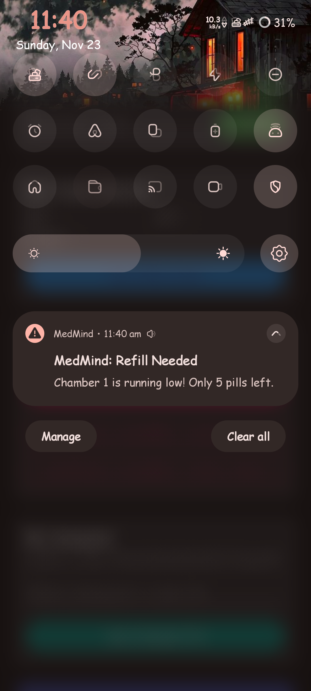

**MedMind Login Screen**

{width="1.556324365704287in"
height="3.458499562554681in"}

Multi-Lingual Option

{width="1.6334372265966755in"
height="3.629861111111111in"}
{width="1.6334372265966755in"
height="3.629861111111111in"}
{width="1.6622342519685038in"
height="3.6938527996500437in"}

Can login as an existing user, new users can register as patient,
caregiver or doctor

{width="2.022965879265092in"
height="4.495479002624672in"}
{width="2.017716535433071in"
height="4.483814523184602in"}
{width="2.022965879265092in"
height="4.495479002624672in"}

Patient UI with Mulitple Languages

{width="3.710465879265092in"
height="2.319040901137358in"}

Caregiver UI (Existing account linked to a patient)

{width="3.981299212598425in"
height="2.4883114610673664in"}

Doctor UI with multiple patients( Existing account)

**Emergency SOS feature**

{width="5.710465879265092in"
height="2.532696850393701in"}

In case of emergency, patient can press this button

{width="5.835465879265092in"
height="2.4638626421697287in"}

{width="6.5in" height="4.0625in"}

In caregiver/doctor phone it will play an emergency alarm( sound and
visual alert as seen from the screenshot)

**Linking to Smart Watch for Vitals Monitoring for doctor/caregiver**

{width="4.4256069553805775in"
height="2.3234437882764656in"}

{width="2.639468503937008in"
height="5.865485564304462in"}
{width="2.60625in"
height="5.791666666666667in"}

Allow the permissions

{width="4.498523622047244in"
height="2.370054680664917in"}

Caregiver/doctor can remotely monitor the vitals remotely using the tab
below

{width="3.690698818897638in"
height="3.362636701662292in"}

{width="4.647965879265092in"
height="6.4117257217847765in"}

**MedMind Ecosystem**

There are three types of users patient, caregiver and doctor. The
patient activity can be monitored by the doctor as well as the
caregiver. The adherence history, vitals can be seen by caregiver/
doctor in their app provided the patient id and caregiver/doctor id's
are connected together. This provides the feature "chat with
caregiver/doctor". Also the patients can request call request to the
caregiver/doctor as well.

{width="2.847481408573928in"
height="1.5344761592300962in"}

Patients can link caregiver/ doctor using this section in the app.

{width="2.975923009623797in"
height="3.4384273840769906in"}

Caregiver/doctor can link to patients to see the adherence history as
well as for chatting using this section.

{width="4.752132545931759in"
height="1.5356430446194225in"}

Patients can chat with caregiver using this button option as well as can
request call as well

{width="1.9363429571303588in"
height="4.302985564304462in"}
{width="4.418799212598425in"
height="2.761748687664042in"}

Patient Doctor/caregiver

{width="6.5in"
height="1.1555555555555554in"}

Patient/caregiver/doctor can request call to one another

{width="6.5in"
height="1.4685181539807524in"}

**AI Medical Companion**

An AI powered Medical Companion that help the patients questions related
to medical activities ( no medicinal advises are allowed to give as
answer). The AI acts as a companion to users. Created to reduce the
loneliness in old aged peoples.

{width="6.5in" height="2.100462598425197in"}

Patients can access the AI Medical Companion from this button in the app

{width="2.1050929571303585in"
height="4.677985564304462in"}
{width="2.1053969816272966in"
height="4.678659230096238in"}

**Scheduling Pill Dispensing from MedMind App to dispense from the
hardware**

We have used two chambers which can dispense two different sized pills
for the prototyping of the hardware.

{width="3.3771325459317585in"
height="2.1294695975503064in"}

Patient or caregiver can schedule the pill dispensing from the app using
the patient UI. Add Schedule button is used for scheduling.

{width="1.945718503937008in"
height="4.323818897637795in"}

The user can name the medication and toggle/add following options.

{width="6.5in"
height="1.9439807524059494in"}

The user can choose from chamber and pills per dose to be dispensed.

{width="6.5in" height="2.220833333333333in"}

The frequency of dispensing can be also set as daily or specific days

{width="6.5in"
height="2.7023140857392827in"}

{width="4.522965879265092in"
height="2.701215004374453in"}

Starting date and Ending date can be also added

{width="3.3771325459317585in"
height="1.8167716535433072in"}

{width="2.3019685039370077in"
height="5.115485564304462in"}

Multiple timings can be set for scheduling.

At the time of dispensing the user mobile phone is prompted with a
notification to take the medicine. As well as notification via speaker
and display in the MedMind Hardware also takes place

{width="2.668799212598425in"
height="5.930664916885389in"}{width="3.335465879265092in"
height="3.4915594925634297in"}

If pill is not taken within a time (IR Sensor logic -- will be
explaining in the hardware part) another notification will be prompted
to the user as below

{width="4.05in" height="9.0in"}

{width="4.043799212598425in"
height="4.1749693788276465in"}

Active Schedules can be also seen from the UI

**Adherence History with AI Coach**

A logger with AI Coach which will log the adherence data whether pill
has been taken on time or not. Along with vital data and adherence data
AI Coach will give suggestions or motivate the user. This adherence data
can be monitored by the caregiver/doctor remotely and can suggest the
user on medication via chat or call.

{width="1.868041338582677in"
height="4.151201881014873in"}
{width="3.211532152230971in"
height="4.151201881014873in"}

Whole UI Adherence percentage, vitals,

AI Coach

{width="2.6118219597550305in"
height="3.2865419947506562in"}\
Achievements (Medals based on streak) , History

Adherence History can be seen by caregiver/doctor from their UI as well
using the below option

{width="3.690698818897638in"
height="3.362636701662292in"}

**Pill Count Logic and IR Monitoring**

{width="3.803770778652668in"
height="3.0113188976377954in"}

It is a feature linked to active dispensing of our MedMind hardware
part. MedMind hardware consists of two chambers that can dispense two
types of pill. After every dispensing the IR sensor will be monitoring
for a particular time ( we have set it as 15 sec for demo to write the
log whether hand is detected or not -- pill taken or not) then if the
pill is not taken within the time the app will be notifying the user
again to take the medicine

{width="4.397965879265092in"
height="3.298474409448819in"}

{width="2.7821522309711284in"
height="2.0866141732283463in"}
{width="3.7521325459317585in"
height="2.8140988626421697in"}

In prototype we have made hardware to dispense two types of pill sizes.
The groove will be taking pill from a section where pills are present
and carry it to the top and drop to a common chamber where pills from
both chambers meet. We have implemented a custom zigzag motion that
ensure not two pills are dispensed at a time . Thus a user has to update
the pill count in each chamber at the starting , after every successfull
dispensing and if patient has taken the pill from the dispensed area
then it log as taken and pill count will decrease. If the pill count
fall behind a certain value then it will prompt the user to refill the
chamber.

{width="1.9937314085739282in"
height="4.430515091863517in"}

Notification to user if pill has been taken successfully
