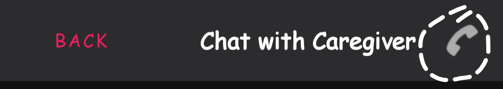

# MedMind – AI-Powered Smart Pill Dispenser & Health Ecosystem


MedMind is an IoT-enabled medication management system designed to help elderly patients take their medicines on time while keeping caregivers and doctors in the loop. It combines a smart pill-dispensing hardware unit with an Android application that provides reminders, AI-powered coaching, vitals monitoring, and real-time alerts.


#The Problem

Medication non-adherence is one of the biggest hidden challenges in elderly care. Many older adults forget doses, double-dose by accident, or skip medicines entirely. Family members living away often have no way to track if their loved ones are following their medication schedule. Most existing solutions like pill boxes or alarms are passive—they cannot verify whether a pill was actually taken.

#The MedMind Solution

MedMind creates a complete medication ecosystem:

1. **Smart Hardware Dispenser** that physically dispenses pills and verifies if the patient picked them up.
2. **Patient Mobile App** providing reminders, schedules, health insights, and automatic inventory tracking.
3. **Caregiver/Doctor Interface** for remote monitoring of adherence, vitals, and alerts.
4. **AI Medical Companion** for supportive, non-medical conversational guidance.

---

# Key Features

##Android App
- Reliable pill reminders with both local alarms & cloud-triggered alerts.
- AI Health Coach powered by Google Gemini for motivational suggestions.
- Syncs vitals like heart rate, steps, and oxygen from WearOS/Samsung watches through Health Connect.
- Emergency SOS that triggers a loud alarm on the caregiver’s phone.
- Automatic pill count tracking based on hardware dispensing.
- Multi-language support (English, Malayalam, Hindi).

## Smart Hardware (ESP8266)
- IR break-beam sensor checks if the pill was actually picked up.
- If not picked up within 15 seconds, the system flags a missed dose.
- Zig-zag servo motion prevents double dispensing or pill jams.
- NTP-based time synchronization for accurate offline dispensing.
- Speaker + display provide clear alerts at the device.

#Tech Stack

| Component | Technology | Purpose |
|----------|------------|---------|
| Mobile App | Kotlin (MVVM) | Patient/Caregiver/Doctor interfaces |
| Backend | Firebase (Auth, Firestore, RTDB) | User management, logs, vitals |
| Hardware | ESP8266 NodeMCU | Controls servos, sensors, alerts |
| Sensors | Servo motors, IR sensor | Dispensing + verification |
| AI Engine | Gemini API | AI medical companion |
| Health Data | Google Health Connect | Sync vitals from wearables |


#Getting Started

## 1. Prerequisites
Make sure you have:

- Android Studio (Koala or newer)
- Arduino IDE
- Firebase project with Auth, Firestore & Realtime DB enabled
- Google Health Connect installed on the Android device


## 2. Hardware Setup

1. Go to the `hardware-code/` folder.
2. Open the `.ino` file in Arduino IDE.
3. Install required libraries:  
   - Firebase ESP Client  
   - ArduinoJson  
   - NTPClient  
4. Update credentials at the top of the code:

```cpp
#define WIFI_SSID "YOUR_WIFI"
#define WIFI_PASSWORD "YOUR_PASSWORD"
#define FIREBASE_DB_URL "YOUR_RTDB_URL"
#define FIREBASE_DB_SECRET "YOUR_DATABASE_SECRET"
#define PATIENT_USER_ID "UID_FROM_APP"
````

5. Upload the code to the NodeMCU.

---

## 3. Android App Setup

1. Clone the repo:

```bash
git clone https://github.com/YOUR_USERNAME/MedMind.git
```

2. Open the `android-app/` folder in Android Studio.
3. Add your Firebase `google-services.json` to:

```
android-app/app/
```

4. Add your Gemini API Key inside `AiCompanionActivity.kt`.
5. Build and run on a physical device (Health Connect doesn’t work on standard emulators).

---

#Hardware Wiring

## MedMind Pill Dispenser – Hardware Wiring Reference

*(ESP8266 NodeMCU + Servos + IR Sensor + Buzzer + LCD I2C)*

### 1. ESP8266 NodeMCU Pins Used

| Component | NodeMCU Pin | GPIO |
| --------- | ----------- | ---- |
| Servo 1   | D5          | 14   |
| Servo 2   | D6          | 12   |
| IR Sensor | D7          | 13   |
| Buzzer    | D8          | 15   |
| LCD SDA   | D2          | 4    |
| LCD SCL   | D1          | 5    |

### 2. Servo Wiring (Both Servos)

| Servo Wire             | Connect To                  |
| ---------------------- | --------------------------- |
| Brown/Black (GND)      | NodeMCU GND                 |
| Red (VCC)              | External 5V                 |
| Orange/Yellow (Signal) | Servo 1 → D5 / Servo 2 → D6 |

⚠ **Important:** NodeMCU GND and external 5V GND must be connected together.

### 3. LCD 16×2 I2C

| LCD Pin | Connect To |
| ------- | ---------- |
| VCC     | 5V         |
| GND     | GND        |
| SDA     | D2         |
| SCL     | D1         |

### 4. IR Sensor

| IR Sensor Pin | Connect To |
| ------------- | ---------- |
| VCC           | 5V         |
| GND           | GND        |
| OUT           | D7         |

### 5. Speaker/Buzzer via LM386

| LM386 Pin | Connect To |
| --------- | ---------- |
| VCC       | 5V         |
| GND       | GND        |
| IN/SIG    | D8         |
| OUT       | Speaker    |

---

#Circuit Diagram


---

#Application Screenshots

*(All screenshots below are medium-sized for readability.)*

---

## Login & Registration


### Multi-Lingual Screens


### Register/Login as Patient, Caregiver, or Doctor


---

## Patient Interface


---

## Caregiver UI


---

## Doctor UI



---

## Emergency SOS


---

## Smartwatch Vitals Linking


---

## MedMind Ecosystem


### Linking Caregivers/Doctors


### Patient Linking from Caregiver Side


### Chat & Call Features


---

## AI Medical Companion


---

## Scheduling Pills


### Notification Examples


---

## Missed Dose Detection


---

## Adherence History & AI Coach


### Caregiver View


---

## Pill Count Logic & Hardware


---

# Team

* **Sreekanth S K** – Team Lead
* **Pranav J P**
*  **Sandra P S** 
* **Sooraj Subhash** 


---

# 📄 License

This project is licensed under the MIT License.

